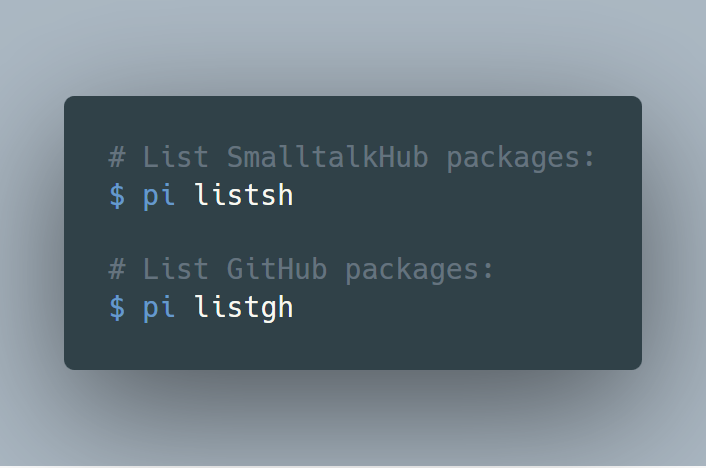
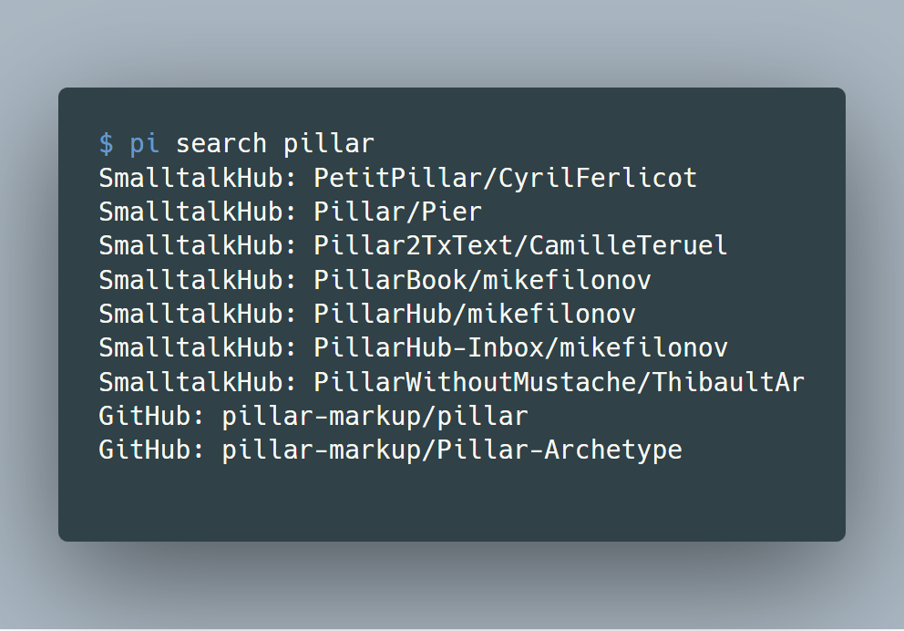
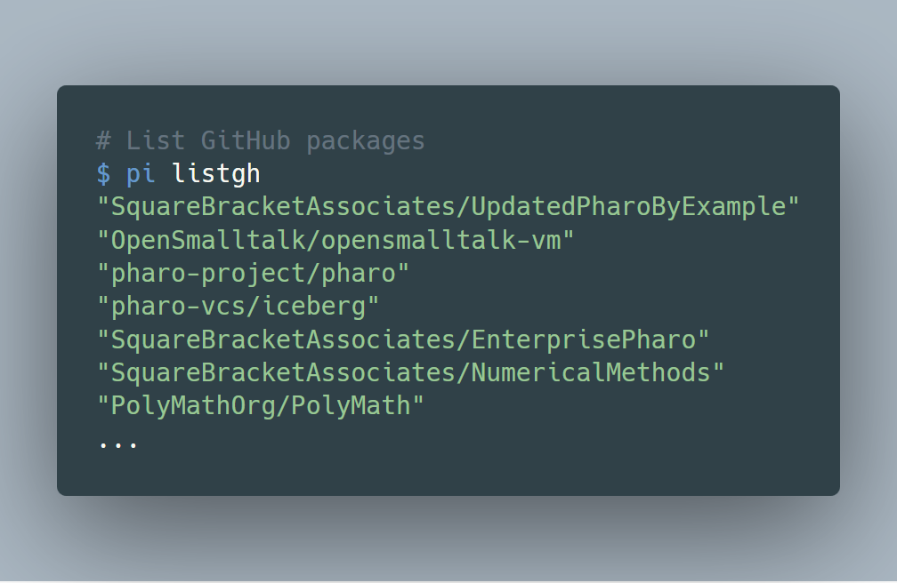

[](https://img.shields.io/badge/license-MIT-blue.svg)
[](http://makeapullrequest.com)
[](http://www.repostatus.org/#active)

# Table of Contents

- [Description](#description)
- [Installation](#installation)
- [Features](#features)
- [Usage](#usage)
  - [Notes](#notes)
  - [Examples](#examples)
- [Troubleshooting](#troubleshooting)
- [Contribute](#contribute)
- [Change Log](#change-log)
- [License](./LICENSE)

# Description

Pharo Install - A command-line tool for installing [Pharo Smalltalk](https://www.pharo.org) packages.

PI is a MIT-pip-like application installer for Pharo Smalltalk. Copy & pasting install scripts found in forums or the web is an easy method, but it’s also time consuming because of the manual interaction, and hard to make the process reproducible.

PI turns copy & paste Smalltalk (Metacello Configurations) install scripts into bash one-liners which works on Unix/Linux, 
MacOS and Windows (MinGW64/MSYS). PI automatically tries to download necessary dependencies for parsing  GitHub repositories lists, and also downloads the latest stable Pharo image and virtual machine if none is found in the current directory. It also supports installing multiple packages at once.

# Requirements

  - bash or zsh
  - curl or wget
  - jq (a command line JSON processor)

# Installation

```bash
bash -c "$(curl -fsSL https://raw.githubusercontent.com/hernanmd/pi/master/install.sh)"
```

## bash users

```bash
echo "export PATH=\"\$HOME/.pi/pi/bin:\$PATH\" >> $HOME/.profile 
```

## zsh users

```bash
path+=$HOME/.pi/pi/bin
```

# Features

  - Listing Pharo packages from GitHub.
  - Installing packages is supported for:
    - Metacello Configurations from Catalog (command line handler: get)
    - GitHub (experimental)
  - It works with curl or wget.
  - Supports case-insensitive searching for package names or developer user name.

# Usage

## Notes

  - The "image" option defaults to the current Pharo "stable" version.
  - PI can query GitHub for package names or usernames.
  - PI can install packages from GitHub repositories (work in progress).
  - Package and username search is case-sensitive.
  - Assume only one image in a directory. Future version will add support for multiple images.  
  - For GitHub repositories: If it has "pharo" as topic, it will be listed.

## Examples

### Installing


### Listing



### Searching

Search both in GitHub repositories:



## Sample outputs



# Troubleshooting

If you experiment problems with pi, please run the collect environment script: 

```bash
./runPiCollectEnv
```

And open an issue with the output in the [Issue Tracker](https://github.com/hernanmd/pi/issues)).

You can obtain the pi version with:

```bash
pi version
```

# Contribute

**Working on your first Pull Request?** You can learn how from this *free* series [How to Contribute to an Open Source Project on 
GitHub](https://egghead.io/series/how-to-contribute-to-an-open-source-project-on-github)

If you have discovered a bug or have a feature suggestion, feel free to create an issue on Github.

If you'd like to make some changes yourself, see the following:

  - Fork this repository to your own GitHub account and then clone it to your local device
  - Edit the pi file with your favorite text editor.
  - Test PI.
  - Add <your GitHub username> to add yourself as author below.
  - Finally, submit a pull request with your changes!
  - This project follows the [all-contributors specification](https://github.com/kentcdodds/all-contributors). Contributions of any kind are welcome!

# ChangeLog

## 0.4.2

  - Add collect environment script

## 0.4.1

  - Added run tests script
  - Use one-liner curl install.sh script
  - Code re-organization

## 0.4.0

  - Added initial bats tests
  - Minor corrections and enhacements

## 0.3.9

  - downloadApp -> initApp 
  - Added package cache directory feature for GitHub repositories.
  - Logical reorganization of functions into an appropriate .sh file to be sourced.

## 0.3.8

  - Fixed minor bug while downloading JQ on MSYS

## 0.3.7

  - Refactorings and style corrections

## 0.3.6

  - Remove the caching "feature" for Pharo GihHub packages.
  - For obtaining the count of GitHub packages download just one item which is enough.
  - Set download application once.
  - Make download applications silent.
  - Remove temprary JSON files from GitHub
  - Added help usage details

## 0.3.5

  - List Pharo GitHub package names.

## 0.3.4

  - Download GitHub package list paginating results (still needs fix & testing)
  - Minor enhacements

## 0.3.3

  - Removed unnecessary function checkLibXML()
  - Removed --no-check-certificate for the Pharo zeroconf website
  - Added specific platform function for installing libXML
  - Added function installLibXMLMSYS to install 32-bit and 64-bit versions depending on platform architecture 
  - All variable names now are lowercased
  - Started to implement function to install packages from GitHub

# ToDo

  - Add log4sh logging feature.
  - Test GitHub package installation
  - Install individual packages instead of only Metacello Configurations.
  - Uninstall packages(?)
  - i18n

