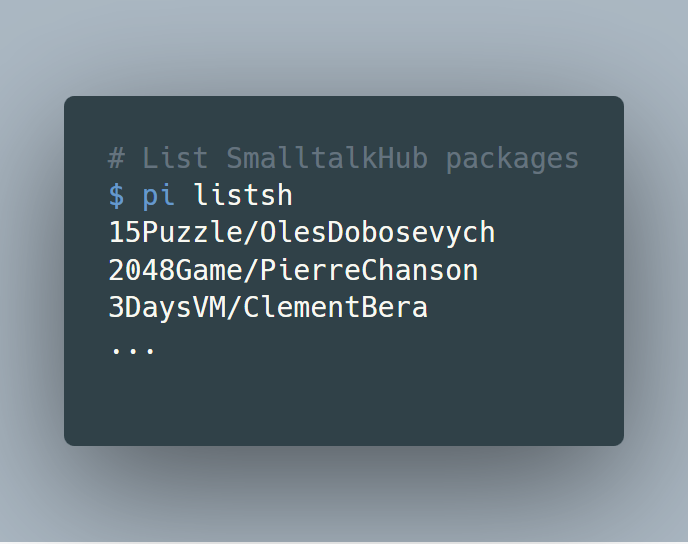

[](https://img.shields.io/badge/license-MIT-blue.svg)
[](http://makeapullrequest.com)
[](http://www.repostatus.org/#active)

# Description

Pharo Install - A tool for installing [Pharo Smalltalk](https://www.pharo.org) packages.

PI is a MIT-pip-like command line application installer for Pharo Smalltalk. PI helps you get Pharo and the libraries you need with minimal effort. Copying & pasting install scripts found in forums or the web is an easy method, but it’s also time consuming because of the manual interaction, and hard to make the process reproducible.

PI turns copy & paste Smalltalk (Metacello Configurations) install scripts into bash one-liners which works on Unix/Linux, 
MacOS and Windows (MinGW64/MSYS). PI automatically tries to download necessary dependencies for parsing both
[SmalltalkHub](https://www.smalltalkhub.com) and GitHub repositories lists, and also downloads the latest stable Pharo image and virtual machine if none is found in the current directory. It also supports installing multiple packages at once.

# Installation

curl users:
```bash
curl -O https://raw.githubusercontent.com/hernanmd/pi/master/pi
```

[wget](https://eternallybored.org/misc/wget/ "wget web site") users:
```bash
wget --no-cache --no-check-certificate https://raw.githubusercontent.com/hernanmd/pi/master/pi
```

Copy the executable script to a location included in the PATH environment variable:

> Note: If your system does not have /usr/local/bin, please mkdir before executing the following commands

```bash
chmod 755 pi
mv pi /usr/local/bin
```

# Features

  - Case-insensitive search for package names or developer user name.
  - List packages from GitHub and SmalltalkHub repositories.
  - Packages installation support for:
    - Metacello Configurations from Catalog (command line handler: get)
    - SmalltalkHub (command line handler: config)
    - GitHub (given the installation script is provided in the README.md)
  - It works with curl or wget.

# Usage

PI is composed of multiple commands, similar to git, apt-get or brew. When you run PI with no arguments help message is displayed, listing all available commands with their options.

PI uses additional software which will be downloaded if not present. Specifically if jq (a command line JSON processor) is not available, it will be downloaded to the directory where pi was executed. Accessing to SmalltalkHub repositories metadata requires also xmllint, which will be downloaded to the directory where pi was executed.

The "image" option defaults to the current Pharo "stable" version. PI assumes only one image in a directory, although future versions will contain support for multiple images.

For GitHub repositories to be discovered by PI, they should contain "pharo" as topic. Additionally, PI can discover and install a package if you just simply add a Markdown comment tag ([//]: # (pi)) before the installation expression. 

# Usage examples

## Installing


## Listing


## Searching

Search both in SmalltalkHub and GitHub repositories:


# Sample outputs




# Troubleshooting

If you experiment problems with pi, check first the versions of the following dependencies (copy & paste results when submitting an issue). PI is being developed in the following environment:

```bash
$ bash --version
GNU bash, version 4.4.19(1)-release (x86_64-pc-msys)
Copyright (C) 2016 Free Software Foundation, Inc.
```

```bash
$ git --version
git version 2.16.2.windows.1
```

```bash
$ wget --version
GNU Wget 1.19.4 built on mingw32.

-cares +digest +gpgme +https +ipv6 +iri +large-file +metalink -nls
+ntlm +opie -psl +ssl/openssl
```

```bash
$ openssl version
OpenSSL 1.0.2n  7 Dec 2017
```


# Contribute

**Working on your first Pull Request?** You can learn how from this *free* series [How to Contribute to an Open Source Project on 
GitHub](https://egghead.io/series/how-to-contribute-to-an-open-source-project-on-github)

If you have discovered a bug or have a feature suggestion, feel free to create an issue on Github.

If you'd like to make some changes yourself, see the following:

  - Fork this repository to your own GitHub account and then clone it to your local device
  - Edit the pi file with your favorite text editor.
  - Test PI.
  - Add <your GitHub username> to add yourself as author below.
  - Finally, submit a pull request with your changes!
  - This project follows the [all-contributors specification](https://github.com/kentcdodds/all-contributors). Contributions of any kind are welcome!

# ChangeLog

## 0.3.8

  - Fixed minor bug while downloading JQ on MSYS

## 0.3.7

  - Refactorings and style corrections

## 0.3.6

  - Remove the caching "feature" for Pharo GihHub packages.
  - For obtaining the count of GitHub packages download just one item which is enough.
  - Set download application once.
  - Make download applications silent.
  - Remove temprary JSON files from GitHub
  - Added help usage details

## 0.3.5

  - List Pharo GitHub package names.

## 0.3.4

  - Download GitHub package list paginating results (still needs fix & testing)
  - Minor enhacements

## 0.3.3

  - Removed unnecessary function checkLibXML()
  - Removed --no-check-certificate for the Pharo zeroconf website
  - Added specific platform function for installing libXML
  - Added function installLibXMLMSYS to install 32-bit and 64-bit versions depending on platform architecture 
  - All variable names now are lowercased
  - Started to implement function to install packages from GitHub

# ToDo

  - Timestamp output ?
  - Implement GitHub package installation
  - Install individual packages instead of only Metacello Configurations.
  - Uninstall packages

# License

This software is licensed under the MIT License.

Copyright Hernán Morales, 2018.

Permission is hereby granted, free of charge, to any person obtaining a copy of this software and associated documentation files (the "Software"), to deal in the Software without restriction, including without limitation the rights to use, copy, modify, merge, publish, distribute, sublicense, and/or sell copies of the Software, and to permit persons to whom the Software is furnished to do so, subject to the following conditions:

The above copyright notice and this permission notice shall be included in all copies or substantial portions of the Software.

THE SOFTWARE IS PROVIDED "AS IS", WITHOUT WARRANTY OF ANY KIND, EXPRESS OR IMPLIED, INCLUDING BUT NOT LIMITED TO THE WARRANTIES OF MERCHANTABILITY, FITNESS FOR A PARTICULAR PURPOSE AND NONINFRINGEMENT. IN NO EVENT SHALL THE AUTHORS OR COPYRIGHT HOLDERS BE LIABLE FOR ANY CLAIM, DAMAGES OR OTHER LIABILITY, WHETHER IN AN ACTION OF CONTRACT, TORT OR OTHERWISE, ARISING FROM, OUT OF OR IN CONNECTION WITH THE SOFTWARE OR THE USE OR OTHER DEALINGS IN THE SOFTWARE.
